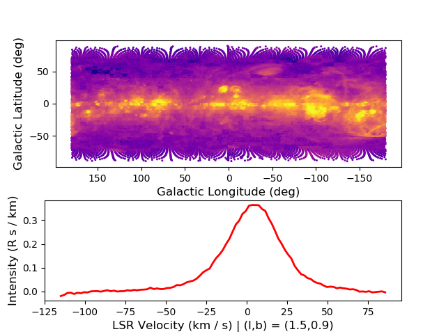
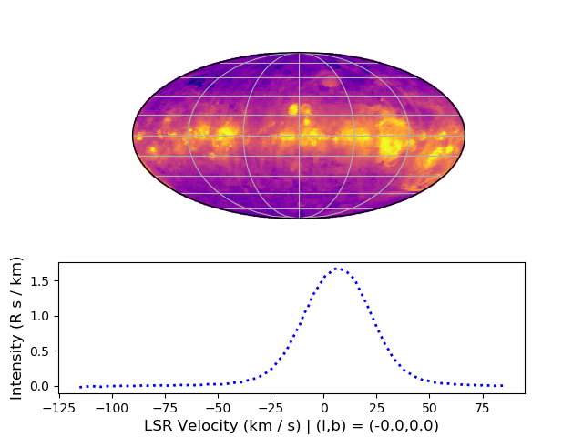
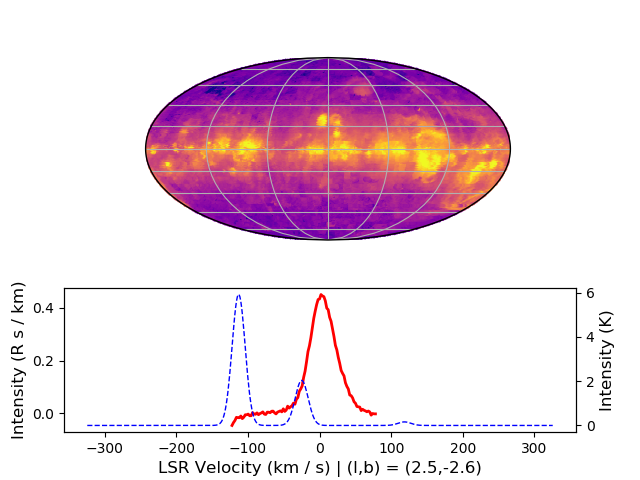
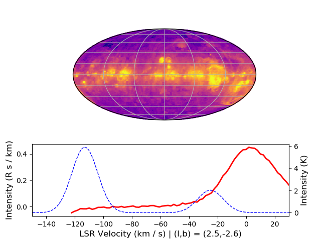

Making Interactive Maps with `whampy`
====================================

You can make interactive maps of the WHAM data where you can click on the map 
and have a spectrum plotted from the nearest WHAM pointing using the `~whampy.whampyTableMixin.click_map` method::

    >>> import matplotlib.pyplot as plt
    >>> %matplotlib notebook
    >>> from whampy.skySurvey import SkySurvey
    >>> survey = SkySurvey()

    >>> click_map = survey.click_map()

`~whampy.whampyTableMixin.click_map` will accept and pass keywords to `~whampy.whampyTableMixin.intensity_map`. You can 
also pass in your own set of figure and axes instances to customize the orientation, shape, and size of axes. The example below uses the optional dependency `cartopy <https://scitools.org.uk/cartopy/docs/latest/>`_ and this package will need to be installed separately following the instructions on its documentation::

    >>> import cartopy.crs as ccrs
    >>> fig = plt.figure()
    >>> image_ax = fig.add_subplot(111, projection = ccrs.Mollweide())

    >>> click_map = survey.click_map(fig = fig, image_ax = image_ax, 
    ...             spectra_kwargs = {"c":'b', "ls": ":"})

Making Interactive Maps that overplot Additional Spectra
--------------------------------------------------------

You can also make these interactive maps and have clicks additionally plot another spectra from a different source.
This additional data can be from a FITS Data cube or another SkySurvey object for other wavelength WHAM observations.

This feature uses the optional dependency `spectral-cube <https://spectral-cube.readthedocs.io/en/latest/#>` package to handle FITS data cubes and this package will need to be installed separately following the instructions on its documentation. spectral-cube can read in 3D datacubes that are regularly gridded with an NAXIS = 3 keyword set in its header and that contains a spectral axis (velocity, wavelength, frequency).::

    >>> fits_cube_path = "hi_data_cube.fits"
    >>> fig = plt.figure()
    >>> click_map = survey.click_map(fig = fig, over_data = fits_cube_path)

You can set the velocity range to be static to focus on certain regions if desired::

    >>> spec_ax = click_map.line_ax
    >>> spec_ax.set_xlim([-150,30])

