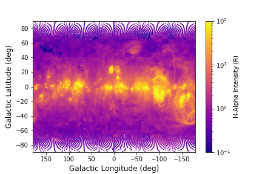
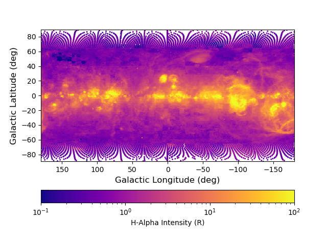
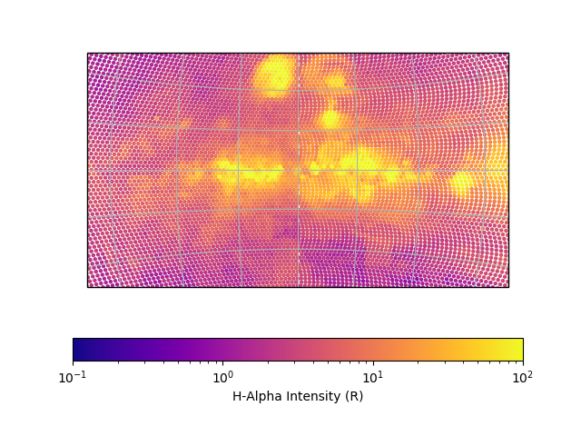
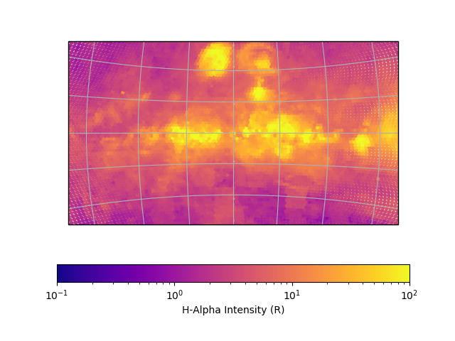

Making Sky Maps with `whampy`
=============================

The :class:`~whampy.skySurvey.SkySurvey` class has a method `~whampy.whampyTableMixin.intensity_map` that allows for 
quick plotting of WHAM beams colored by their intensity with the help of matplotlib::

    >>> from whampy.skySurvey import SkySurvey

    >>> # Load Survey
    >>> survey = SkySurvey()
    >>> # Quick Sky Map
    >>> fig = survey.intensity_map(colorbar = True)

You can provide your own set of figure or axes subplot instances as keywords. This allows you to 
plot these points onto different projections or over other data::

    >>> import matplotlib.pyplot as plt
    >>> fig = plt.figure()
    >>> ax = fig.add_subplot(111)

    >>> fig = survey.intensity_map(ax = ax, fig = fig, 
    ...                         colorbar = True, 
    ...                         cbar_kwargs = {"orientation":"horizontal"})

Different map projections are also support, especially with the help of the transform keyword. 
This can done with either astropy WCSaxes or using `cartopy`. this method also finds a best guess 
default size for the plot markers. This can also be set manually with the keyword `s` or altered
by some factor using the `s_factor` keywword::

    >>> import cartopy.crs as ccrs
    >>> fig = plt.figure()
    >>> ax = fig.add_subplot(111, projection = ccrs.Stereographic())

    >>> lrange = [50,-50] # Longitude Range
    >>> brange = [-20,20] # Latitude Range
    >>> fig = survey.intensity_map(ax = ax, lrange = lrange, brange = brange, 
    ...                             transform = ccrs.PlateCarree(), 
    ...                             colorbar = True, 
    ...                             cbar_kwargs = {"orientation":"horizontal"})

   >>> fig = survey.intensity_map(ax = ax, lrange = lrange, brange = brange, 
   ...                              transform = ccrs.PlateCarree(), s_factor = 2
   ...                              colorbar = True, 
   ...                              cbar_kwargs = {"orientation":"horizontal"})

