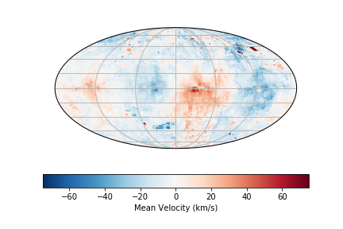

Making Moment Maps with `whampy`
===============================

The :class:`~whampy.skySurvey.SkySurvey` class has a method `~whampy.whampyTableMixin.moment` to quickly compute 
moment maps with the survey::

    >>> from whampy.skySurvey import SkySurvey
    >>> import matplotlib.pyplot as plt
    >>> import cartopy.crs as ccrs

    >>> # Load Survey
    >>> survey = SkySurvey()

    >>> # First Moment 
    >>> mean_vel = survey.moment(order = 1)
    >>> # Sky Map
    >>> fig = plt.figure()
    >>> ax = fig.add_subplot(111, projection = ccrs.Mollweide(central_longitude=0))

    >>> fig = survey.intensity_map(ax = ax, c = mean_vel, vmin = -75, vmax = 75, 
    ...                            norm = None, cmap = "RdBu_r", colorbar = True, 
    ...                            cbar_kwargs={"orientation":"horizontal", 
    ...                                         "label":"Mean Velocity (km/s)"})

