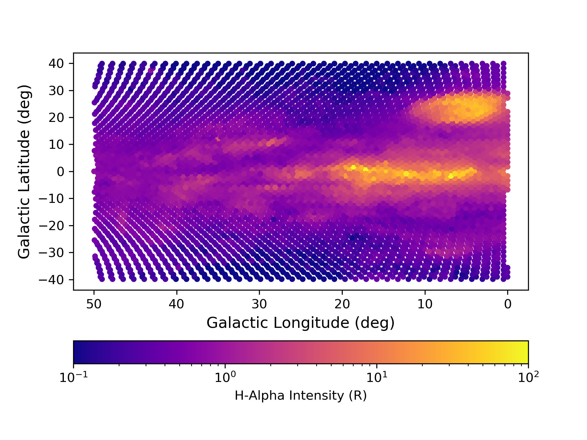

Making Spiral Arm Maps with `whampy`
====================================

The :class:`~whampy.skySurvey.SkySurvey` class has a method `~whampy.whampyTableMixin.get_spiral_slice` to quickly extract
sky section maps with the survey using tracks in longitude-velocity space. 
`~whampy` comes pre-loaded with spiral arm tracks from `Reid et al. 2016 <https://ui.adsabs.harvard.edu/abs/2016ApJ...823...77R/abstract>`::

    >>> from whampy.skySurvey import SkySurvey

    >>> # Load Survey
    >>> survey = SkySurvey()

    >>> # Extract Perseus Arm Map 
    >>> perseus_arm = survey.get_spiral_slice(track = "perseus")
    >>> # Sky Map

	>>> fig = perseus_arm.intensity_map(colorbar = True, s_factor = 2
                     			   cbar_kwargs={"orientation":"horizontal"})

