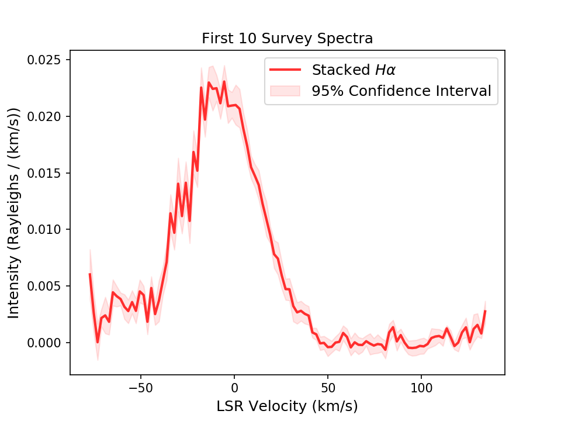

Stacking Spectra via bootstrap with `whampy`
============================================

The :class:`~whampy.skySurvey.SkySurvey` class has a method :method:`~whampy.whampyTableMixin.stack_spectra_bootstrap` to quickly stack spectra via a bootstrap estimation method. 

For example, we can stack the first 10 spectra in the survey::

    >>> from whampy.skySurvey import SkySurvey

    >>> # Load Survey
    >>> survey = SkySurvey()

    >>> # Stack first 10 spectra
    >>> stacked_spectrum = survey[0:10].stack_spectra_bootstrap(set_name = "First 10 Survey Spectra")

    >>> # Plot results
    >>> import matplotlib.pyplot as plt

    >>> fig = plt.figure()
    >>> ax = fig.add_subplot(111)
    >>> ax.plot(stacked_spectrum["VELOCITY"][0], 
    ...         stacked_spectrum["DATA"][0], 
    ...         color = 'r', 
    ...         lw = 2, 
    ...         alpha = 0.8, 
    ...         label = r"Stacked $H\alpha$")
    >>> ax.fill_between(stacked_spectrum["VELOCITY"][0], 
    ...                 stacked_spectrum["CI"][0][0], 
    ...                 stacked_spectrum["CI"][0][1], 
    ...                 color = "r", 
    ...                 alpha = 0.1, 
    ...                 label = "95% Confidence Interval")

    >>> ax.set_xlabel("LSR Velocity (km/s)", fontsize = 12)
    >>> ax.set_ylabel("Intensity (Rayleighs / (km/s))", fontsize = 12)
    >>> ax.set_title("{0}".format(stacked_spectrum["NAME"][0]), 
    ...              fontsize = 12)

    >>> leg = ax.legend(fontsize = 12)

